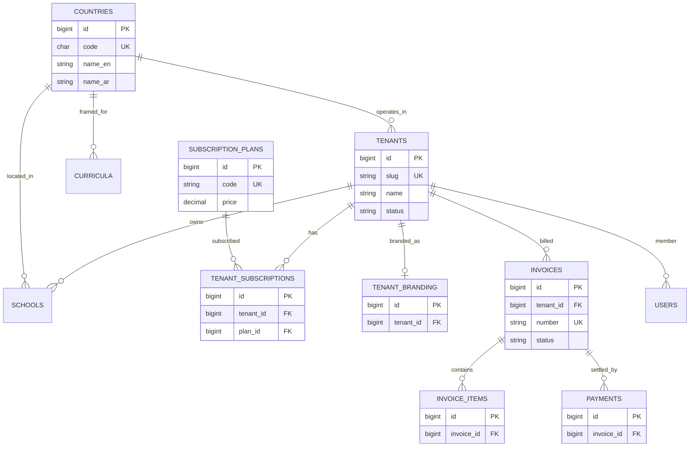
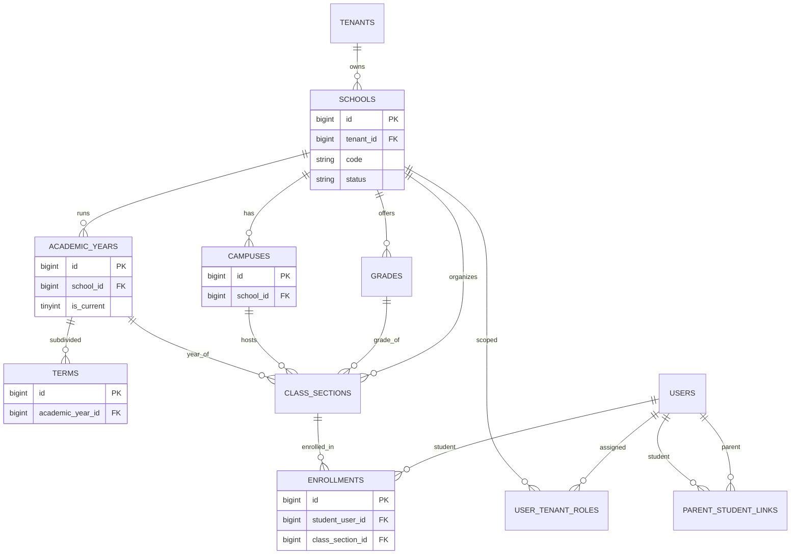
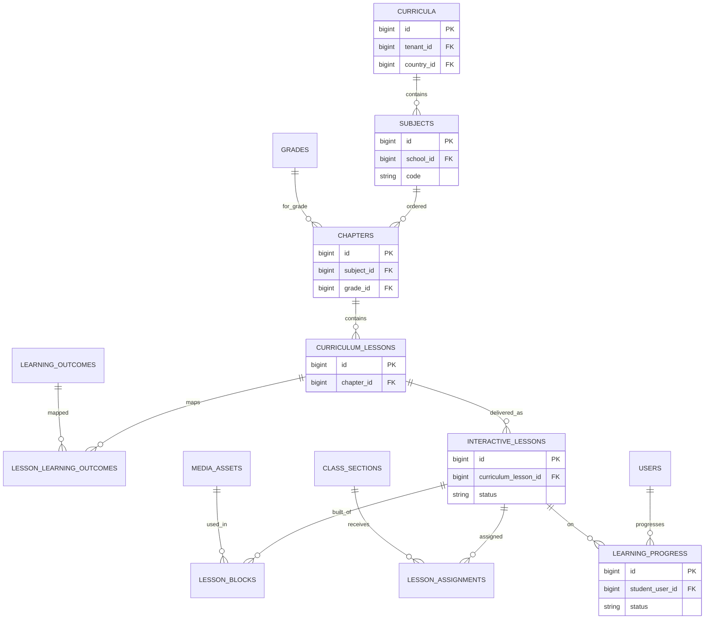
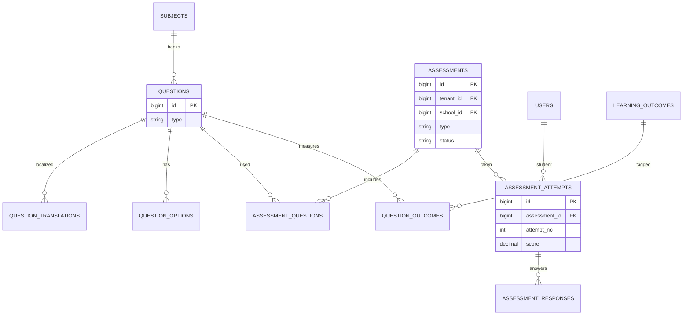
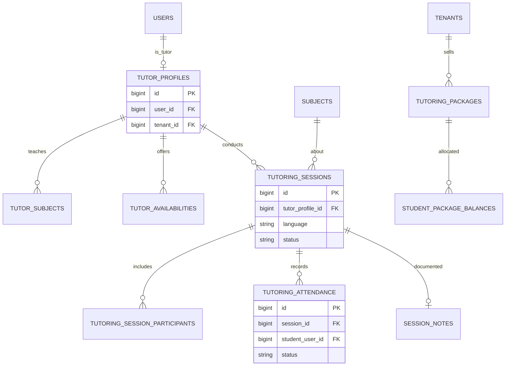
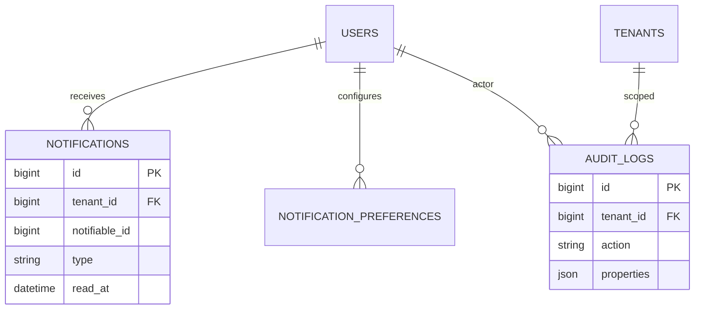

# Phase 4 — Database Design

## K-12 STEM & Tutoring Platform

| Field | Value |
| --- | --- |
| **Document Title** | Database Design |
| **Database Name** | `learning_platform` |
| **Engine** | InnoDB · `utf8mb4` · `utf8mb4_unicode_ci` |
| **Target** | MySQL 8+ / MariaDB 10.4+ (XAMPP) |
| **Version** | 1.0 (Approved) |
| **Status** | Approved — Schema Authorized |
| **Date** | 29 July 2026 |
| **Approved On** | 29 July 2026 |
| **Depends On** | SRS · Architecture v1.1 · Module Planning Phase 3 |
| **Schema File** | `docs/sql/learning_platform_schema_v1.sql` |

---

## Document Control

| Version | Date | Author | Description |
| --- | --- | --- | --- |
| 1.0 | 2026-07-29 | Data Architecture | Phase 4 database design draft |
| 1.0 | 2026-07-29 | Data Architecture | Stakeholder approved; schema apply authorized |

**Approval gate:** Cleared. DDL may be applied to `learning_platform`.

---

## 1. Design Principles

| Principle | Decision |
| --- | --- |
| Tenancy | Shared DB/schema; `tenant_id` on all tenant-owned tables |
| School isolation | `school_id` on school-owned rows |
| Tenant URL | `tenants.slug` unique (Institution/Learner portals) |
| PKs | `BIGINT UNSIGNED` auto-increment |
| Soft deletes | `deleted_at` DATETIME NULL on business tables |
| Audit columns | `created_at`, `updated_at`, `created_by`, `updated_by` |
| Money | `DECIMAL(12,2)` + `currency` CHAR(3) |
| Text | Bilingual via `*_translations` tables or dual `*_en`/`*_ar` where simple |
| Enums | VARCHAR/ENUM for status; prefer VARCHAR for extensibility on evolving domains |
| Cascades | Restrict deletes on financial/academic history; soft-delete parents |

### 1.1 Standard Column Sets

**Audit + soft delete (most business tables):**

| Column | Type | Notes |
| --- | --- | --- |
| `id` | BIGINT UNSIGNED PK AI | |
| `created_at` | DATETIME NOT NULL | |
| `updated_at` | DATETIME NOT NULL | |
| `deleted_at` | DATETIME NULL | Soft delete |
| `created_by` | BIGINT UNSIGNED NULL | FK → users.id |
| `updated_by` | BIGINT UNSIGNED NULL | FK → users.id |

**Tenant scope:**

| Column | Type | Notes |
| --- | --- | --- |
| `tenant_id` | BIGINT UNSIGNED NOT NULL | FK → tenants.id |

**School scope (when applicable):**

| Column | Type | Notes |
| --- | --- | --- |
| `school_id` | BIGINT UNSIGNED NOT NULL | FK → schools.id |

---

## 2. ER Diagrams

### 2.1 Multi-Tenant · SaaS · Billing · Branding



### 2.2 School Structure · Identity



### 2.3 Curriculum · Lessons · Learning



### 2.4 Assessments



### 2.5 Tutoring · Attendance



### 2.6 Notifications · Audit



---

## 3. Table Catalog

### 3.1 Platform & Multi-Tenant

#### `countries`

| Column | Type | Constraints |
| --- | --- | --- |
| id | BIGINT UNSIGNED | PK AI |
| code | CHAR(2) | UNIQUE NOT NULL (ISO) |
| name_en | VARCHAR(100) | NOT NULL |
| name_ar | VARCHAR(100) | NOT NULL |
| default_locale | VARCHAR(10) | NOT NULL DEFAULT 'en' |
| default_timezone | VARCHAR(64) | NOT NULL |
| is_active | TINYINT(1) | NOT NULL DEFAULT 1 |
| created_at, updated_at | DATETIME | NOT NULL |
| deleted_at | DATETIME | NULL |
| created_by, updated_by | BIGINT UNSIGNED | NULL |

**Indexes:** `PRIMARY(id)`, `UNIQUE(code)`, `INDEX(is_active)`

**Seed (V1):** `SA` (Asia/Riyadh, ar), `AE` (Asia/Dubai, en)

---

#### `tenants`

| Column | Type | Constraints |
| --- | --- | --- |
| id | BIGINT UNSIGNED | PK AI |
| slug | VARCHAR(80) | UNIQUE NOT NULL |
| name | VARCHAR(191) | NOT NULL |
| legal_name | VARCHAR(191) | NULL |
| primary_country_id | BIGINT UNSIGNED | FK countries.id |
| default_locale | VARCHAR(10) | NOT NULL DEFAULT 'en' |
| default_timezone | VARCHAR(64) | NOT NULL |
| status | VARCHAR(32) | NOT NULL DEFAULT 'active' (`active`,`trial`,`suspended`,`closed`) |
| trial_ends_at | DATETIME | NULL |
| created_at, updated_at | DATETIME | NOT NULL |
| deleted_at | DATETIME | NULL |
| created_by, updated_by | BIGINT UNSIGNED | NULL |

**Indexes:** `UNIQUE(slug)`, `INDEX(status)`, `INDEX(primary_country_id)`, `INDEX(deleted_at)`

---

#### `subscription_plans`

| Column | Type | Constraints |
| --- | --- | --- |
| id | BIGINT UNSIGNED | PK AI |
| code | VARCHAR(64) | UNIQUE NOT NULL |
| name_en, name_ar | VARCHAR(191) | NOT NULL |
| price | DECIMAL(12,2) | NOT NULL DEFAULT 0 |
| currency | CHAR(3) | NOT NULL DEFAULT 'SAR' |
| max_schools | INT UNSIGNED | NULL (=unlimited) |
| max_campuses | INT UNSIGNED | NULL |
| max_students | INT UNSIGNED | NULL |
| max_teachers | INT UNSIGNED | NULL |
| max_storage_mb | INT UNSIGNED | NULL |
| modules_json | JSON | NOT NULL (feature flags) |
| is_active | TINYINT(1) | NOT NULL DEFAULT 1 |
| audit + soft delete | | standard |

**Indexes:** `UNIQUE(code)`, `INDEX(is_active)`

---

#### `tenant_subscriptions`

| Column | Type | Constraints |
| --- | --- | --- |
| id | BIGINT UNSIGNED | PK AI |
| tenant_id | BIGINT UNSIGNED | FK tenants NOT NULL |
| plan_id | BIGINT UNSIGNED | FK subscription_plans NOT NULL |
| starts_at, ends_at | DATETIME | ends_at NULL |
| status | VARCHAR(32) | NOT NULL (`active`,`expired`,`cancelled`) |
| audit + soft delete | | standard |

**Indexes:** `INDEX(tenant_id, status)`, `INDEX(plan_id)`  
**Constraint:** one active subscription per tenant enforced in app (+ partial unique if supported)

---

#### `tenant_branding`

| Column | Type | Constraints |
| --- | --- | --- |
| id | BIGINT UNSIGNED | PK AI |
| tenant_id | BIGINT UNSIGNED | UNIQUE FK tenants |
| logo_path | VARCHAR(500) | NULL |
| favicon_path | VARCHAR(500) | NULL |
| primary_color | VARCHAR(32) | NULL |
| secondary_color | VARCHAR(32) | NULL |
| email_footer_en / email_footer_ar | TEXT | NULL |
| audit + soft delete | | standard |

---

### 3.2 Billing

#### `invoices`

| Column | Type | Constraints |
| --- | --- | --- |
| id | BIGINT UNSIGNED | PK AI |
| tenant_id | BIGINT UNSIGNED | FK NOT NULL |
| number | VARCHAR(64) | UNIQUE NOT NULL |
| currency | CHAR(3) | NOT NULL |
| subtotal, tax_total, total | DECIMAL(12,2) | NOT NULL |
| status | VARCHAR(32) | NOT NULL (`draft`,`sent`,`paid`,`overdue`,`void`) |
| issued_at, due_at, paid_at | DATETIME | NULL |
| notes | TEXT | NULL |
| pdf_path | VARCHAR(500) | NULL |
| audit + soft delete | | standard |

**Indexes:** `UNIQUE(number)`, `INDEX(tenant_id, status)`, `INDEX(due_at)`

#### `invoice_items`

| Column | Type | Constraints |
| --- | --- | --- |
| id | BIGINT UNSIGNED | PK AI |
| invoice_id | BIGINT UNSIGNED | FK invoices ON DELETE CASCADE |
| description | VARCHAR(500) | NOT NULL |
| quantity | DECIMAL(12,2) | NOT NULL DEFAULT 1 |
| unit_price | DECIMAL(12,2) | NOT NULL |
| line_total | DECIMAL(12,2) | NOT NULL |
| created_at, updated_at | DATETIME | NOT NULL |

*(Line items: no soft delete — delete with invoice void workflow)*

#### `payments`

| Column | Type | Constraints |
| --- | --- | --- |
| id | BIGINT UNSIGNED | PK AI |
| tenant_id | BIGINT UNSIGNED | FK NOT NULL |
| invoice_id | BIGINT UNSIGNED | FK invoices NOT NULL |
| amount | DECIMAL(12,2) | NOT NULL |
| currency | CHAR(3) | NOT NULL |
| method | VARCHAR(32) | NOT NULL (`manual`,`bank`,`card`,`other`) |
| reference | VARCHAR(191) | NULL |
| paid_at | DATETIME | NOT NULL |
| audit + soft delete | | standard |

**Indexes:** `INDEX(invoice_id)`, `INDEX(tenant_id, paid_at)`

---

### 3.3 Identity & RBAC

#### `users`

| Column | Type | Constraints |
| --- | --- | --- |
| id | BIGINT UNSIGNED | PK AI |
| tenant_id | BIGINT UNSIGNED | NULL FK (NULL = platform Super Admin only) |
| email | VARCHAR(191) | NOT NULL |
| password | VARCHAR(255) | NOT NULL |
| first_name, last_name | VARCHAR(100) | NOT NULL |
| first_name_ar, last_name_ar | VARCHAR(100) | NULL |
| phone | VARCHAR(32) | NULL |
| locale | VARCHAR(10) | NOT NULL DEFAULT 'en' |
| timezone | VARCHAR(64) | NULL |
| status | VARCHAR(32) | NOT NULL DEFAULT 'active' |
| email_verified_at | DATETIME | NULL |
| last_login_at | DATETIME | NULL |
| remember_token | VARCHAR(100) | NULL |
| audit + soft delete | | standard |

**Indexes:** `UNIQUE(tenant_id, email)`, `INDEX(status)`, `INDEX(deleted_at)`  
**Note:** Platform Super Admin rows use `tenant_id = NULL`; uniqueness treated as `(email)` where tenant_id IS NULL (app-enforced / generated unique key).

#### `roles`

| Column | Type | Constraints |
| --- | --- | --- |
| id | BIGINT UNSIGNED | PK AI |
| code | VARCHAR(64) | UNIQUE NOT NULL |
| name_en, name_ar | VARCHAR(100) | NOT NULL |
| portal | VARCHAR(32) | NOT NULL (`control`,`institution`,`learner`) |
| is_system | TINYINT(1) | NOT NULL DEFAULT 1 |
| created_at, updated_at | DATETIME | NOT NULL |

**Seed codes:** `super_admin`, `tenant_owner`, `school_admin`, `campus_admin`, `academic_coordinator`, `teacher`, `tutor`, `student`, `parent`

#### `user_tenant_roles`

| Column | Type | Constraints |
| --- | --- | --- |
| id | BIGINT UNSIGNED | PK AI |
| user_id | BIGINT UNSIGNED | FK NOT NULL |
| tenant_id | BIGINT UNSIGNED | FK NOT NULL |
| role_id | BIGINT UNSIGNED | FK NOT NULL |
| school_id | BIGINT UNSIGNED | NULL FK |
| campus_id | BIGINT UNSIGNED | NULL FK |
| audit + soft delete | | standard |

**Indexes:** `UNIQUE(user_id, tenant_id, role_id, school_id, campus_id)`, `INDEX(tenant_id, role_id)`, `INDEX(school_id)`

#### `parent_student_links`

| Column | Type | Constraints |
| --- | --- | --- |
| id | BIGINT UNSIGNED | PK AI |
| tenant_id | BIGINT UNSIGNED | FK NOT NULL |
| parent_user_id | BIGINT UNSIGNED | FK users NOT NULL |
| student_user_id | BIGINT UNSIGNED | FK users NOT NULL |
| relationship | VARCHAR(32) | NULL |
| is_primary | TINYINT(1) | NOT NULL DEFAULT 0 |
| audit + soft delete | | standard |

**Indexes:** `UNIQUE(parent_user_id, student_user_id)`, `INDEX(tenant_id, student_user_id)`

---

### 3.4 School Structure

#### `schools`

| Column | Type | Constraints |
| --- | --- | --- |
| id | BIGINT UNSIGNED | PK AI |
| tenant_id | BIGINT UNSIGNED | FK NOT NULL |
| country_id | BIGINT UNSIGNED | FK NOT NULL |
| code | VARCHAR(64) | NOT NULL |
| name_en, name_ar | VARCHAR(191) | NOT NULL |
| status | VARCHAR(32) | NOT NULL DEFAULT 'active' |
| timezone | VARCHAR(64) | NULL |
| audit + soft delete | | standard |

**Indexes:** `UNIQUE(tenant_id, code)`, `INDEX(tenant_id, status)`, `INDEX(country_id)`

#### `campuses`

| Column | Type | Constraints |
| --- | --- | --- |
| id | BIGINT UNSIGNED | PK AI |
| tenant_id | BIGINT UNSIGNED | FK NOT NULL |
| school_id | BIGINT UNSIGNED | FK NOT NULL |
| code | VARCHAR(64) | NOT NULL |
| name_en, name_ar | VARCHAR(191) | NOT NULL |
| timezone | VARCHAR(64) | NULL |
| address | VARCHAR(500) | NULL |
| status | VARCHAR(32) | NOT NULL DEFAULT 'active' |
| audit + soft delete | | standard |

**Indexes:** `UNIQUE(school_id, code)`, `INDEX(tenant_id, school_id)`

#### `academic_years`

| Column | Type | Constraints |
| --- | --- | --- |
| id | BIGINT UNSIGNED | PK AI |
| tenant_id, school_id | BIGINT UNSIGNED | FK NOT NULL |
| name | VARCHAR(100) | NOT NULL |
| starts_on, ends_on | DATE | NOT NULL |
| is_current | TINYINT(1) | NOT NULL DEFAULT 0 |
| status | VARCHAR(32) | NOT NULL DEFAULT 'planned' |
| audit + soft delete | | standard |

**Indexes:** `INDEX(school_id, is_current)`, `INDEX(tenant_id, school_id)`

#### `terms`

| Column | Type | Constraints |
| --- | --- | --- |
| id | BIGINT UNSIGNED | PK AI |
| tenant_id | BIGINT UNSIGNED | FK NOT NULL |
| academic_year_id | BIGINT UNSIGNED | FK NOT NULL |
| name_en, name_ar | VARCHAR(100) | NOT NULL |
| sequence | INT UNSIGNED | NOT NULL DEFAULT 1 |
| starts_on, ends_on | DATE | NOT NULL |
| status | VARCHAR(32) | NOT NULL DEFAULT 'upcoming' |
| audit + soft delete | | standard |

**Indexes:** `INDEX(academic_year_id, sequence)`

#### `grades`

| Column | Type | Constraints |
| --- | --- | --- |
| id | BIGINT UNSIGNED | PK AI |
| tenant_id, school_id | BIGINT UNSIGNED | FK NOT NULL |
| code | VARCHAR(32) | NOT NULL |
| name_en, name_ar | VARCHAR(100) | NOT NULL |
| sequence | INT UNSIGNED | NOT NULL |
| audit + soft delete | | standard |

**Indexes:** `UNIQUE(school_id, code)`, `INDEX(school_id, sequence)`

#### `class_sections`

| Column | Type | Constraints |
| --- | --- | --- |
| id | BIGINT UNSIGNED | PK AI |
| tenant_id, school_id | BIGINT UNSIGNED | FK NOT NULL |
| campus_id | BIGINT UNSIGNED | NULL FK |
| academic_year_id | BIGINT UNSIGNED | FK NOT NULL |
| grade_id | BIGINT UNSIGNED | FK NOT NULL |
| name | VARCHAR(64) | NOT NULL |
| section_code | VARCHAR(32) | NULL |
| status | VARCHAR(32) | NOT NULL DEFAULT 'active' |
| audit + soft delete | | standard |

**Indexes:** `INDEX(school_id, academic_year_id, grade_id)`, `INDEX(campus_id)`

#### `enrollments`

| Column | Type | Constraints |
| --- | --- | --- |
| id | BIGINT UNSIGNED | PK AI |
| tenant_id, school_id | BIGINT UNSIGNED | FK NOT NULL |
| academic_year_id | BIGINT UNSIGNED | FK NOT NULL |
| class_section_id | BIGINT UNSIGNED | FK NOT NULL |
| student_user_id | BIGINT UNSIGNED | FK NOT NULL |
| grade_id | BIGINT UNSIGNED | FK NOT NULL |
| status | VARCHAR(32) | NOT NULL DEFAULT 'active' (`active`,`transferred`,`withdrawn`) |
| enrolled_on | DATE | NULL |
| audit + soft delete | | standard |

**Indexes:** `UNIQUE(student_user_id, academic_year_id, class_section_id)`, `INDEX(tenant_id, school_id, status)`, `INDEX(class_section_id)`

---

### 3.5 Curriculum & Lessons

#### `curricula`

| Column | Type | Constraints |
| --- | --- | --- |
| id | BIGINT UNSIGNED | PK AI |
| tenant_id | BIGINT UNSIGNED | NULL (NULL = platform template) |
| school_id | BIGINT UNSIGNED | NULL |
| country_id | BIGINT UNSIGNED | FK NOT NULL |
| code | VARCHAR(64) | NOT NULL |
| name_en, name_ar | VARCHAR(191) | NOT NULL |
| version | VARCHAR(32) | NULL |
| status | VARCHAR(32) | NOT NULL DEFAULT 'draft' |
| source_curriculum_id | BIGINT UNSIGNED | NULL (cloned from) |
| audit + soft delete | | standard |

**Indexes:** `INDEX(tenant_id, school_id)`, `INDEX(country_id)`, `UNIQUE(tenant_id, school_id, code, version)` *(app-handle NULLs)*

#### `subjects`

| Column | Type | Constraints |
| --- | --- | --- |
| id | BIGINT UNSIGNED | PK AI |
| tenant_id, school_id | BIGINT UNSIGNED | FK NOT NULL |
| curriculum_id | BIGINT UNSIGNED | NULL FK |
| code | VARCHAR(64) | NOT NULL |
| name_en, name_ar | VARCHAR(191) | NOT NULL |
| is_stem | TINYINT(1) | NOT NULL DEFAULT 1 |
| tutoring_enabled | TINYINT(1) | NOT NULL DEFAULT 1 |
| status | VARCHAR(32) | NOT NULL DEFAULT 'active' |
| audit + soft delete | | standard |

**Indexes:** `UNIQUE(school_id, code)`, `INDEX(tenant_id, school_id)`

#### `chapters`

| Column | Type | Constraints |
| --- | --- | --- |
| id | BIGINT UNSIGNED | PK AI |
| tenant_id, school_id | BIGINT UNSIGNED | FK NOT NULL |
| subject_id | BIGINT UNSIGNED | FK NOT NULL |
| grade_id | BIGINT UNSIGNED | FK NOT NULL |
| title_en, title_ar | VARCHAR(255) | NOT NULL |
| sequence | INT UNSIGNED | NOT NULL DEFAULT 1 |
| status | VARCHAR(32) | NOT NULL DEFAULT 'draft' |
| audit + soft delete | | standard |

**Indexes:** `INDEX(subject_id, grade_id, sequence)`, `INDEX(tenant_id, school_id)`

#### `curriculum_lessons`

| Column | Type | Constraints |
| --- | --- | --- |
| id | BIGINT UNSIGNED | PK AI |
| tenant_id, school_id | BIGINT UNSIGNED | FK NOT NULL |
| chapter_id | BIGINT UNSIGNED | FK NOT NULL |
| code | VARCHAR(64) | NULL |
| title_en, title_ar | VARCHAR(255) | NOT NULL |
| summary_en, summary_ar | TEXT | NULL |
| sequence | INT UNSIGNED | NOT NULL DEFAULT 1 |
| estimated_minutes | INT UNSIGNED | NULL |
| difficulty | VARCHAR(32) | NULL |
| status | VARCHAR(32) | NOT NULL DEFAULT 'draft' |
| audit + soft delete | | standard |

**Indexes:** `INDEX(chapter_id, sequence)`, `INDEX(tenant_id, school_id, status)`

#### `learning_outcomes`

| Column | Type | Constraints |
| --- | --- | --- |
| id | BIGINT UNSIGNED | PK AI |
| tenant_id, school_id | BIGINT UNSIGNED | FK NOT NULL |
| subject_id | BIGINT UNSIGNED | NULL FK |
| code | VARCHAR(64) | NOT NULL |
| statement_en, statement_ar | TEXT | NOT NULL |
| status | VARCHAR(32) | NOT NULL DEFAULT 'active' |
| audit + soft delete | | standard |

**Indexes:** `UNIQUE(school_id, code)`, `INDEX(subject_id)`

#### `lesson_learning_outcomes`

| Column | Type | Constraints |
| --- | --- | --- |
| id | BIGINT UNSIGNED | PK AI |
| curriculum_lesson_id | BIGINT UNSIGNED | FK NOT NULL |
| learning_outcome_id | BIGINT UNSIGNED | FK NOT NULL |
| created_at | DATETIME | NOT NULL |

**Indexes:** `UNIQUE(curriculum_lesson_id, learning_outcome_id)`

#### `media_assets`

| Column | Type | Constraints |
| --- | --- | --- |
| id | BIGINT UNSIGNED | PK AI |
| tenant_id | BIGINT UNSIGNED | FK NOT NULL |
| school_id | BIGINT UNSIGNED | NULL FK |
| type | VARCHAR(32) | NOT NULL (`video`,`pdf`,`image`,`audio`,`other`) |
| title_en, title_ar | VARCHAR(255) | NULL |
| disk_path | VARCHAR(500) | NULL |
| external_url | VARCHAR(1000) | NULL |
| mime_type | VARCHAR(128) | NULL |
| size_bytes | BIGINT UNSIGNED | NULL |
| duration_seconds | INT UNSIGNED | NULL |
| audit + soft delete | | standard |

**Indexes:** `INDEX(tenant_id, school_id, type)`

#### `interactive_lessons`

| Column | Type | Constraints |
| --- | --- | --- |
| id | BIGINT UNSIGNED | PK AI |
| tenant_id, school_id | BIGINT UNSIGNED | FK NOT NULL |
| curriculum_lesson_id | BIGINT UNSIGNED | NULL FK |
| title_en, title_ar | VARCHAR(255) | NOT NULL |
| status | VARCHAR(32) | NOT NULL DEFAULT 'draft' |
| completion_rule | VARCHAR(32) | NOT NULL DEFAULT 'view_all' |
| published_at | DATETIME | NULL |
| audit + soft delete | | standard |

**Indexes:** `INDEX(tenant_id, school_id, status)`, `INDEX(curriculum_lesson_id)`

#### `lesson_blocks`

| Column | Type | Constraints |
| --- | --- | --- |
| id | BIGINT UNSIGNED | PK AI |
| interactive_lesson_id | BIGINT UNSIGNED | FK ON DELETE CASCADE |
| block_type | VARCHAR(32) | NOT NULL (`text`,`video`,`pdf`,`simulation`,`virtual_lab`,`embed`,`check`) |
| sequence | INT UNSIGNED | NOT NULL |
| payload_json | JSON | NOT NULL |
| media_asset_id | BIGINT UNSIGNED | NULL FK |
| created_at, updated_at | DATETIME | NOT NULL |

**Indexes:** `INDEX(interactive_lesson_id, sequence)`

#### `lesson_assignments`

| Column | Type | Constraints |
| --- | --- | --- |
| id | BIGINT UNSIGNED | PK AI |
| tenant_id, school_id | BIGINT UNSIGNED | FK NOT NULL |
| interactive_lesson_id | BIGINT UNSIGNED | FK NOT NULL |
| class_section_id | BIGINT UNSIGNED | NULL FK |
| student_user_id | BIGINT UNSIGNED | NULL FK |
| assigned_by | BIGINT UNSIGNED | FK users |
| due_at | DATETIME | NULL |
| status | VARCHAR(32) | NOT NULL DEFAULT 'assigned' |
| audit + soft delete | | standard |

**Indexes:** `INDEX(class_section_id, due_at)`, `INDEX(student_user_id)`, `INDEX(interactive_lesson_id)`

#### `learning_progress`

| Column | Type | Constraints |
| --- | --- | --- |
| id | BIGINT UNSIGNED | PK AI |
| tenant_id, school_id | BIGINT UNSIGNED | FK NOT NULL |
| student_user_id | BIGINT UNSIGNED | FK NOT NULL |
| interactive_lesson_id | BIGINT UNSIGNED | FK NOT NULL |
| status | VARCHAR(32) | NOT NULL (`not_started`,`in_progress`,`completed`) |
| progress_percent | DECIMAL(5,2) | NOT NULL DEFAULT 0 |
| score | DECIMAL(8,2) | NULL |
| started_at, completed_at | DATETIME | NULL |
| last_position_json | JSON | NULL |
| audit columns | | created_at/updated_at; soft delete optional |

**Indexes:** `UNIQUE(student_user_id, interactive_lesson_id)`, `INDEX(tenant_id, school_id, status)`, `INDEX(completed_at)`

#### `assignments` (homework / general work)

| Column | Type | Constraints |
| --- | --- | --- |
| id | BIGINT UNSIGNED | PK AI |
| tenant_id, school_id | BIGINT UNSIGNED | FK NOT NULL |
| subject_id | BIGINT UNSIGNED | NULL FK |
| class_section_id | BIGINT UNSIGNED | NULL FK |
| title_en, title_ar | VARCHAR(255) | NOT NULL |
| instructions_en, instructions_ar | TEXT | NULL |
| due_at | DATETIME | NULL |
| allow_late | TINYINT(1) | NOT NULL DEFAULT 1 |
| is_scored | TINYINT(1) | NOT NULL DEFAULT 0 |
| max_score | DECIMAL(8,2) | NULL |
| include_in_reports | TINYINT(1) | NOT NULL DEFAULT 1 |
| status | VARCHAR(32) | NOT NULL DEFAULT 'published' |
| created_by teacher | | audit standard + soft delete |

**Indexes:** `INDEX(school_id, due_at)`, `INDEX(class_section_id, status)`

#### `assignment_submissions`

| Column | Type | Constraints |
| --- | --- | --- |
| id | BIGINT UNSIGNED | PK AI |
| assignment_id | BIGINT UNSIGNED | FK NOT NULL |
| student_user_id | BIGINT UNSIGNED | FK NOT NULL |
| tenant_id | BIGINT UNSIGNED | FK NOT NULL |
| body_text | TEXT | NULL |
| file_path | VARCHAR(500) | NULL |
| submitted_at | DATETIME | NULL |
| is_late | TINYINT(1) | NOT NULL DEFAULT 0 |
| score | DECIMAL(8,2) | NULL |
| feedback | TEXT | NULL |
| status | VARCHAR(32) | NOT NULL DEFAULT 'draft' |
| audit + soft delete | | standard |

**Indexes:** `UNIQUE(assignment_id, student_user_id)`, `INDEX(tenant_id, status)`

---

### 3.6 Assessments

#### `questions`

| Column | Type | Constraints |
| --- | --- | --- |
| id | BIGINT UNSIGNED | PK AI |
| tenant_id, school_id | BIGINT UNSIGNED | FK NOT NULL |
| subject_id | BIGINT UNSIGNED | NULL FK |
| type | VARCHAR(32) | NOT NULL (`mcq`,`multi`,`boolean`,`numeric`,`short_text`) |
| difficulty | VARCHAR(32) | NULL |
| default_points | DECIMAL(8,2) | NOT NULL DEFAULT 1 |
| status | VARCHAR(32) | NOT NULL DEFAULT 'active' |
| audit + soft delete | | standard |

#### `question_translations`

| Column | Type | Constraints |
| --- | --- | --- |
| id | BIGINT UNSIGNED | PK AI |
| question_id | BIGINT UNSIGNED | FK ON DELETE CASCADE |
| locale | VARCHAR(10) | NOT NULL |
| stem | TEXT | NOT NULL |
| explanation | TEXT | NULL |

**Indexes:** `UNIQUE(question_id, locale)`

#### `question_options`

| Column | Type | Constraints |
| --- | --- | --- |
| id | BIGINT UNSIGNED | PK AI |
| question_id | BIGINT UNSIGNED | FK ON DELETE CASCADE |
| locale | VARCHAR(10) | NOT NULL |
| label | VARCHAR(500) | NOT NULL |
| is_correct | TINYINT(1) | NOT NULL DEFAULT 0 |
| sequence | INT UNSIGNED | NOT NULL DEFAULT 1 |

**Indexes:** `INDEX(question_id, locale, sequence)`

#### `question_outcomes`

| Column | Type | Constraints |
| --- | --- | --- |
| question_id | BIGINT UNSIGNED | PK/FK |
| learning_outcome_id | BIGINT UNSIGNED | PK/FK |

#### `assessments`

| Column | Type | Constraints |
| --- | --- | --- |
| id | BIGINT UNSIGNED | PK AI |
| tenant_id, school_id | BIGINT UNSIGNED | FK NOT NULL |
| subject_id | BIGINT UNSIGNED | NULL FK |
| term_id | BIGINT UNSIGNED | NULL FK |
| class_section_id | BIGINT UNSIGNED | NULL FK |
| type | VARCHAR(32) | NOT NULL (`quiz`,`exam`,`homework`,`practice`) |
| title_en, title_ar | VARCHAR(255) | NOT NULL |
| instructions_en, instructions_ar | TEXT | NULL |
| time_limit_seconds | INT UNSIGNED | NULL |
| max_attempts | INT UNSIGNED | NOT NULL DEFAULT 1 |
| available_from, available_until | DATETIME | NULL |
| shuffle_questions | TINYINT(1) | NOT NULL DEFAULT 0 |
| show_results | VARCHAR(32) | NOT NULL DEFAULT 'after_submit' |
| counts_toward_grade | TINYINT(1) | NOT NULL DEFAULT 1 |
| status | VARCHAR(32) | NOT NULL DEFAULT 'draft' |
| audit + soft delete | | standard |

**Indexes:** `INDEX(tenant_id, school_id, type, status)`, `INDEX(class_section_id, available_from)`, `INDEX(term_id)`

#### `assessment_questions`

| Column | Type | Constraints |
| --- | --- | --- |
| id | BIGINT UNSIGNED | PK AI |
| assessment_id | BIGINT UNSIGNED | FK ON DELETE CASCADE |
| question_id | BIGINT UNSIGNED | FK NOT NULL |
| sequence | INT UNSIGNED | NOT NULL |
| points | DECIMAL(8,2) | NOT NULL |

**Indexes:** `UNIQUE(assessment_id, question_id)`, `INDEX(assessment_id, sequence)`

#### `assessment_attempts`

| Column | Type | Constraints |
| --- | --- | --- |
| id | BIGINT UNSIGNED | PK AI |
| tenant_id | BIGINT UNSIGNED | FK NOT NULL |
| assessment_id | BIGINT UNSIGNED | FK NOT NULL |
| student_user_id | BIGINT UNSIGNED | FK NOT NULL |
| attempt_no | INT UNSIGNED | NOT NULL |
| locale | VARCHAR(10) | NOT NULL |
| status | VARCHAR(32) | NOT NULL (`in_progress`,`submitted`,`graded`,`void`) |
| score | DECIMAL(8,2) | NULL |
| max_score | DECIMAL(8,2) | NULL |
| started_at, submitted_at, graded_at | DATETIME | NULL |
| audit + soft delete | | standard |

**Indexes:** `UNIQUE(assessment_id, student_user_id, attempt_no)`, `INDEX(tenant_id, student_user_id)`, `INDEX(status)`

#### `assessment_responses`

| Column | Type | Constraints |
| --- | --- | --- |
| id | BIGINT UNSIGNED | PK AI |
| attempt_id | BIGINT UNSIGNED | FK ON DELETE CASCADE |
| question_id | BIGINT UNSIGNED | FK NOT NULL |
| response_json | JSON | NULL |
| is_correct | TINYINT(1) | NULL |
| points_awarded | DECIMAL(8,2) | NULL |
| graded_by | BIGINT UNSIGNED | NULL |
| created_at, updated_at | DATETIME | NOT NULL |

**Indexes:** `UNIQUE(attempt_id, question_id)`

---

### 3.7 Tutoring · Attendance

#### `tutor_profiles`

| Column | Type | Constraints |
| --- | --- | --- |
| id | BIGINT UNSIGNED | PK AI |
| tenant_id | BIGINT UNSIGNED | FK NOT NULL |
| user_id | BIGINT UNSIGNED | FK NOT NULL |
| school_id | BIGINT UNSIGNED | NULL FK |
| bio_en, bio_ar | TEXT | NULL |
| status | VARCHAR(32) | NOT NULL DEFAULT 'active' |
| audit + soft delete | | standard |

**Indexes:** `UNIQUE(tenant_id, user_id)`, `INDEX(school_id, status)`

#### `tutor_subjects`

| Column | Type | Constraints |
| --- | --- | --- |
| tutor_profile_id | BIGINT UNSIGNED | PK/FK |
| subject_id | BIGINT UNSIGNED | PK/FK |
| languages_json | JSON | NOT NULL (e.g. `["ar","en"]`) |

#### `tutor_availabilities`

| Column | Type | Constraints |
| --- | --- | --- |
| id | BIGINT UNSIGNED | PK AI |
| tenant_id | BIGINT UNSIGNED | FK NOT NULL |
| tutor_profile_id | BIGINT UNSIGNED | FK NOT NULL |
| campus_id | BIGINT UNSIGNED | NULL FK |
| weekday | TINYINT UNSIGNED | NOT NULL (0–6) |
| start_time, end_time | TIME | NOT NULL |
| slot_minutes | INT UNSIGNED | NOT NULL DEFAULT 60 |
| timezone | VARCHAR(64) | NOT NULL |
| is_active | TINYINT(1) | NOT NULL DEFAULT 1 |
| audit + soft delete | | standard |

**Indexes:** `INDEX(tutor_profile_id, weekday, is_active)`

#### `tutor_availability_exceptions`

| Column | Type | Constraints |
| --- | --- | --- |
| id | BIGINT UNSIGNED | PK AI |
| tutor_profile_id | BIGINT UNSIGNED | FK NOT NULL |
| exception_date | DATE | NOT NULL |
| is_available | TINYINT(1) | NOT NULL (0=block,1=extra) |
| start_time, end_time | TIME | NULL |
| reason | VARCHAR(255) | NULL |
| audit | | soft delete optional |

**Indexes:** `INDEX(tutor_profile_id, exception_date)`

#### `tutoring_packages`

| Column | Type | Constraints |
| --- | --- | --- |
| id | BIGINT UNSIGNED | PK AI |
| tenant_id, school_id | BIGINT UNSIGNED | FK NOT NULL |
| name_en, name_ar | VARCHAR(191) | NOT NULL |
| total_minutes | INT UNSIGNED | NOT NULL |
| status | VARCHAR(32) | NOT NULL DEFAULT 'active' |
| audit + soft delete | | standard |

#### `student_package_balances`

| Column | Type | Constraints |
| --- | --- | --- |
| id | BIGINT UNSIGNED | PK AI |
| tenant_id | BIGINT UNSIGNED | FK NOT NULL |
| tutoring_package_id | BIGINT UNSIGNED | FK NOT NULL |
| student_user_id | BIGINT UNSIGNED | FK NOT NULL |
| minutes_remaining | INT UNSIGNED | NOT NULL |
| expires_at | DATETIME | NULL |
| audit + soft delete | | standard |

**Indexes:** `INDEX(student_user_id, expires_at)`

#### `tutoring_sessions`

| Column | Type | Constraints |
| --- | --- | --- |
| id | BIGINT UNSIGNED | PK AI |
| tenant_id, school_id | BIGINT UNSIGNED | FK NOT NULL |
| campus_id | BIGINT UNSIGNED | NULL FK |
| tutor_profile_id | BIGINT UNSIGNED | FK NOT NULL |
| subject_id | BIGINT UNSIGNED | FK NOT NULL |
| language | VARCHAR(10) | NOT NULL (`ar`,`en`) |
| session_type | VARCHAR(32) | NOT NULL DEFAULT 'one_to_one' (`one_to_one`,`group`) |
| starts_at | DATETIME | NOT NULL |
| ends_at | DATETIME | NOT NULL |
| status | VARCHAR(32) | NOT NULL (`scheduled`,`in_progress`,`completed`,`cancelled`,`no_show`) |
| meeting_provider | VARCHAR(32) | NULL |
| meeting_url | VARCHAR(1000) | NULL |
| meeting_external_id | VARCHAR(191) | NULL |
| recording_url | VARCHAR(1000) | NULL (Future; nullable reserved) |
| cancelled_at | DATETIME | NULL |
| cancel_reason | VARCHAR(500) | NULL |
| minutes_consumed | INT UNSIGNED | NULL |
| booked_by | BIGINT UNSIGNED | NULL FK users |
| audit + soft delete | | standard |

**Indexes:** `INDEX(tenant_id, school_id, starts_at)`, `INDEX(tutor_profile_id, starts_at, status)`, `INDEX(status, starts_at)`

#### `tutoring_session_participants`

| Column | Type | Constraints |
| --- | --- | --- |
| id | BIGINT UNSIGNED | PK AI |
| tutoring_session_id | BIGINT UNSIGNED | FK ON DELETE CASCADE |
| student_user_id | BIGINT UNSIGNED | FK NOT NULL |
| role | VARCHAR(32) | NOT NULL DEFAULT 'learner' |

**Indexes:** `UNIQUE(tutoring_session_id, student_user_id)`, `INDEX(student_user_id)`

#### `tutoring_attendance`

| Column | Type | Constraints |
| --- | --- | --- |
| id | BIGINT UNSIGNED | PK AI |
| tenant_id | BIGINT UNSIGNED | FK NOT NULL |
| tutoring_session_id | BIGINT UNSIGNED | FK NOT NULL |
| student_user_id | BIGINT UNSIGNED | FK NOT NULL |
| status | VARCHAR(32) | NOT NULL (`present`,`absent`,`late`,`excused`) |
| marked_by | BIGINT UNSIGNED | NULL FK |
| marked_at | DATETIME | NOT NULL |
| notes | VARCHAR(500) | NULL |
| audit + soft delete | | standard |

**Indexes:** `UNIQUE(tutoring_session_id, student_user_id)`, `INDEX(tenant_id, student_user_id)`, `INDEX(status)`

#### `session_notes`

| Column | Type | Constraints |
| --- | --- | --- |
| id | BIGINT UNSIGNED | PK AI |
| tutoring_session_id | BIGINT UNSIGNED | UNIQUE FK |
| tutor_profile_id | BIGINT UNSIGNED | FK NOT NULL |
| notes | TEXT | NOT NULL |
| follow_up | TEXT | NULL |
| visible_to_parent | TINYINT(1) | NOT NULL DEFAULT 1 |
| audit + soft delete | | standard |

---

### 3.8 Notifications

#### `notifications`

Laravel-compatible shape + tenant scope:

| Column | Type | Constraints |
| --- | --- | --- |
| id | CHAR(36) | PK (UUID) |
| tenant_id | BIGINT UNSIGNED | FK NOT NULL |
| type | VARCHAR(255) | NOT NULL |
| notifiable_type | VARCHAR(255) | NOT NULL |
| notifiable_id | BIGINT UNSIGNED | NOT NULL |
| data | JSON | NOT NULL |
| read_at | DATETIME | NULL |
| created_at, updated_at | DATETIME | NULL |

**Indexes:** `INDEX(tenant_id, notifiable_type, notifiable_id)`, `INDEX(read_at)`

#### `notification_preferences`

| Column | Type | Constraints |
| --- | --- | --- |
| id | BIGINT UNSIGNED | PK AI |
| tenant_id | BIGINT UNSIGNED | FK NOT NULL |
| user_id | BIGINT UNSIGNED | FK NOT NULL |
| event_type | VARCHAR(100) | NOT NULL |
| channel | VARCHAR(32) | NOT NULL (`mail`,`database`) |
| is_enabled | TINYINT(1) | NOT NULL DEFAULT 1 |
| created_at, updated_at | DATETIME | NOT NULL |

**Indexes:** `UNIQUE(user_id, event_type, channel)`

#### `mail_logs` (optional ops)

| Column | Type | Constraints |
| --- | --- | --- |
| id | BIGINT UNSIGNED | PK AI |
| tenant_id | BIGINT UNSIGNED | NULL |
| to_email | VARCHAR(191) | NOT NULL |
| subject | VARCHAR(255) | NOT NULL |
| status | VARCHAR(32) | NOT NULL |
| provider_message_id | VARCHAR(191) | NULL |
| created_at | DATETIME | NOT NULL |

**Indexes:** `INDEX(tenant_id, created_at)`, `INDEX(status)`

---

### 3.9 Certificates · Achievements · Audit (supporting)

#### `certificates`

| Column | Type | Constraints |
| --- | --- | --- |
| id | BIGINT UNSIGNED | PK AI |
| tenant_id, school_id | BIGINT UNSIGNED | FK NOT NULL |
| student_user_id | BIGINT UNSIGNED | FK NOT NULL |
| title_en, title_ar | VARCHAR(255) | NOT NULL |
| issued_at | DATETIME | NOT NULL |
| voided_at | DATETIME | NULL |
| pdf_path | VARCHAR(500) | NULL |
| verification_code | VARCHAR(64) | UNIQUE NULL |
| snapshot_json | JSON | NULL |
| audit + soft delete | | standard |

#### `achievements` / `student_achievements`

Definitions + awards (Could priority) — included in SQL as thin tables.

#### `audit_logs`

| Column | Type | Constraints |
| --- | --- | --- |
| id | BIGINT UNSIGNED | PK AI |
| tenant_id | BIGINT UNSIGNED | NULL |
| actor_user_id | BIGINT UNSIGNED | NULL |
| action | VARCHAR(100) | NOT NULL |
| auditable_type | VARCHAR(255) | NULL |
| auditable_id | BIGINT UNSIGNED | NULL |
| properties | JSON | NULL |
| ip_address | VARCHAR(45) | NULL |
| user_agent | VARCHAR(500) | NULL |
| created_at | DATETIME | NOT NULL |

**Indexes:** `INDEX(tenant_id, created_at)`, `INDEX(actor_user_id, created_at)`, `INDEX(auditable_type, auditable_id)`  
**Note:** No soft delete / updated_at — append-only.

---

## 4. Relationships Summary

| Parent | Child | Type | On delete intent |
| --- | --- | --- | --- |
| tenants | schools, users*, invoices, … | 1:N | Restrict + soft-delete tenant |
| schools | campuses, years, subjects, … | 1:N | Restrict |
| academic_years | terms, class_sections | 1:N | Restrict |
| chapters | curriculum_lessons | 1:N | Restrict |
| curriculum_lessons | interactive_lessons | 1:N | Set null / restrict |
| interactive_lessons | lesson_blocks | 1:N | Cascade |
| assessments | assessment_questions, attempts | 1:N | Cascade questions; restrict attempts if graded |
| tutoring_sessions | participants, attendance | 1:N | Cascade participants; restrict attendance history preferred |
| invoices | items, payments | 1:N | Cascade items; restrict payments |
| users | roles, enrollments, attempts | 1:N | Restrict |

\*Users: `tenant_id` nullable for Super Admin.

---

## 5. Index Strategy

| Pattern | Purpose |
| --- | --- |
| `(tenant_id, …)` leading | Multi-tenant query isolation & performance |
| `(tenant_id, school_id, …)` | School isolation lists |
| UNIQUE business keys | slug, codes, attempt numbers, attendance pairs |
| `(starts_at/due_at/status)` | Scheduling & dashboards |
| `(deleted_at)` | Soft-delete aware listings (or always filter in ORM global scope) |
| JSON | Not indexed in V1; extract generated columns later if needed |

---

## 6. Constraints & Integrity Rules

1. **FK** on all `tenant_id` / `school_id` references where the parent is required.  
2. **App-level:** `school.tenant_id` must equal child `tenant_id` (validate in Form Requests / observers).  
3. **Slug:** `^[a-z0-9]+(?:-[a-z0-9]+)*$`, globally unique.  
4. **Money:** `total = subtotal + tax_total` validated in domain.  
5. **Session:** `ends_at > starts_at`.  
6. **Term dates** within academic year dates.  
7. **One current** academic year per school (partial unique / trigger / app).  
8. **Parent link** both users same `tenant_id`.  
9. **Soft delete:** unique keys should consider active rows only — use composite unique including soft-delete workaround or filtered uniques in app for MariaDB 10.4.  
10. **Recording URL** nullable; unused in V1 UI.

---

## 7. Soft Deletes Policy

| Apply `deleted_at` | Do **not** soft-delete |
| --- | --- |
| tenants, schools, campuses, users, academic structures | invoice_items (void invoice instead) |
| curriculum & learning entities | lesson_blocks (owned cascade) |
| assessments, questions, attempts | assessment_responses (cascade with attempt) |
| tutoring sessions, attendance, packages | audit_logs (immutable) |
| invoices, payments, branding, media | notifications optional (mark read / prune job) |

Restore: only Super Admin / Tenant Owner for critical entities; academic restores audited.

---

## 8. Audit Columns Policy

| Column | Set by |
| --- | --- |
| `created_at` / `updated_at` | ORM timestamps |
| `created_by` / `updated_by` | Auth user id via model trait; NULL for system/jobs |
| `audit_logs` | Explicit domain events for security-sensitive actions |

Security-sensitive actions always write `audit_logs`: login failures (optional), role changes, grade overrides, impersonation, invoice void, tenant suspend.

---

## 9. Laravel / Sanctum Support Tables

Include standard framework tables in schema deploy:

- `password_reset_tokens`
- `personal_access_tokens` (Sanctum)
- `sessions` (if using DB sessions)
- `jobs`, `job_batches`, `failed_jobs`
- `cache`, `cache_locks` (optional)

These follow Laravel defaults (see SQL file).

---

## 10. Entity Count (V1 Design)

Approximately **55+** domain tables + Laravel support tables, grouped as:

| Domain | Tables (approx.) |
| --- | --- |
| SaaS / Billing / Branding | 8 |
| Identity / RBAC | 5 |
| School structure | 8 |
| Curriculum / Learning | 14 |
| Assessment | 8 |
| Tutoring / Attendance | 10 |
| Notifications / Audit / Certs | 6+ |
| Laravel support | 6+ |

---

## 11. DDL Artifact

Full MySQL/MariaDB DDL targeted at database **`learning_platform`**:

**`docs/sql/learning_platform_schema_v1.sql`**

Apply only after approval:

```bash
C:\xampp\mysql\bin\mysql.exe -u root learning_platform < docs/sql/learning_platform_schema_v1.sql
```

---

## 12. Open Decisions

| ID | Topic | Recommendation |
| --- | --- | --- |
| DB-01 | User email uniqueness | Unique per tenant; platform admins global |
| DB-02 | Soft-delete vs unique | App validates uniqueness among non-deleted |
| DB-03 | Bilingual storage | Dual columns for short fields; translation tables for questions |
| DB-04 | UUID vs BIGINT PK | BIGINT for domain; UUID for notifications |
| DB-05 | Apply seed countries/roles in same script | Yes, minimal seeds in SQL |

---

## 13. Approval Sign-Off

| Role | Name | Signature | Date |
| --- | --- | --- | --- |
| Business Owner | | | |
| Engineering Lead | | | |
| Data / Backend Lead | | | |

---

## 14. Next Steps (After Approval)

1. Apply `learning_platform_schema_v1.sql` to MySQL database `learning_platform`  
2. Generate Laravel migrations matching this schema (or import baseline)  
3. Eloquent models + tenant global scopes  
4. Isolation test suite  

---

**End of Document — Status: APPROVED — SCHEMA AUTHORIZED**
